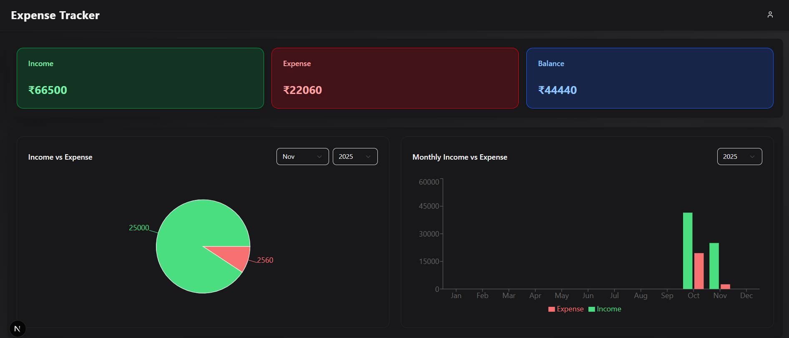
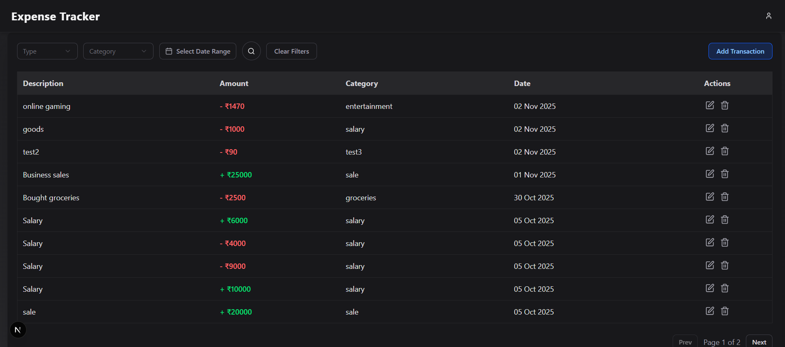

## Expense Tracker (MERN + Next.js)

A full-stack **Expense Tracker** web application built using **MongoDB, Express, Node.js, and Next.js (React)**.  
This app allows users to **track income & expenses, visualize spending through charts, filter transactions by date/type/category, and manage their finances efficiently.**

---

## 🚀 Features

- User Authentication (JWT-based)
- Add, Edit, Delete Transactions
- Filter by Type, Category, and Date Range
- Dynamic Charts 
- Secure REST APIs (Node.js + Express + MongoDB)
- Frontend built with Next.js + TypeScript + Tailwind + shadcn/ui

---

## ⚙️ Backend Setup

```bash
1️⃣ Clone the Repository

2️⃣ Navigate to Backend Folder:
cd backend

3️⃣ Install Dependencies:
npm install

4️⃣ Create .env file in the backend root:
PORT=5000
MONGO_URI=your_mongodb_connection_string
JWT_SECRET=your_random_secret_key

5️⃣ Run the Server:
npm run dev

✅ The backend should now be running at:
http://localhost:5000
```
## ⚙️ Frontend Setup

```bash
1️⃣ Open a new terminal and go to frontend folder:
cd ../frontend

2️⃣ Install Dependencies:
npm install

3️⃣ Run the Next.js App:
npm run dev

✅ The frontend should now be running at:
http://localhost:3000
```

## 🧠 Tech Stack

## Frontend

- Next.js (React + TypeScript)
- Tailwind CSS
- Shadcn/UI Components
- Recharts (for charts)
- Redux Toolkit
- React Toastify

## Backend

- Node.js
- Express.js
- MongoDB + Mongoose
- JSON Web Tokens (JWT)

## 📸 Screenshots



